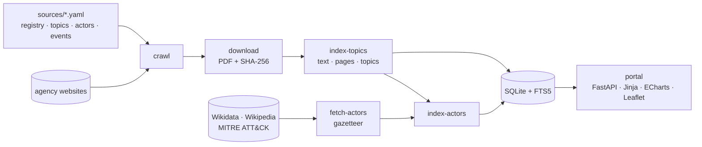

<div align="center">

# Rozvedka

**A self-hosted library of the public reports of intelligence, security and civil-protection agencies –
collected, searchable, indexed by topic and actor, and traceable back to the page they came from.**


[Features](#features) · [Quick start](#quick-start) · [Commands](#commands) · [Configuration](#configuration) ·
[How it works](#how-it-works) · [Development](#development) · [Sources & licences](#data-sources-and-licences)


</div>

## About

Intelligence services, cyber-security centres, civil-protection authorities and police agencies publish annual
reports, threat assessments and risk analyses. Rozvedka gathers them from the agencies' own websites into one
local library, so you can follow how state security, social resilience and disaster preparedness are developing
– and who reports on what.

| | |
|---|---|
| **Coverage** | 134 agencies and institutions in 50 countries and bodies: 26 EU member states, EU bodies and NATO, every NATO member except Montenegro (Iceland, Albania, North Macedonia, Türkiye, the UK, Norway, the USA, Canada), Switzerland, Ukraine, six Latin American countries, Australia, New Zealand, Japan, South Korea and Taiwan |
| **Library** | about 3,450 reports in 30 languages, with archives back to 2000, downloaded as PDF |
| **Index** | full text of every report, 64 topics from a 3,800-term multilingual keyword list, about 1,550 named actors and 189 countries |
| **Runs on** | a Raspberry Pi (or any Linux box) – Python, SQLite and the browser; no cloud service, no account |

> [!IMPORTANT]
> **Everything is traceable.** Every number on every chart opens the list of documents it counts; every actor
> mention links to the page of the PDF it was found on; every external fact (an event date, a Wikidata
> designation, a Wikipedia summary) carries its source, revision and retrieval date. Nothing is estimated or
> generated – counts are counts of documents.

## Features

### 🛰️ Home – search console and dashboards

The start page (`/`): an ASCII radar and word mark, one search box for the whole library, and what is new.

- **Search console** – type words, `"a phrase"`, or filters: `country:DE`, `coalition:NATO`, `agency:BIS`,
  `type:cyber`, `topic:ransomware`, `actor:"Fancy Bear"`, `year:2020..2025`, `lang:de`. The search opens the
  Documents list with those filters set. A misspelt or ambiguous filter is explained, with the choices as links
  (`agency:BIS` → BIS in Czechia or Slovakia).
- **Suggestions as you type** – actors (by any of their names, e.g. `APT28` → Fancy Bear), topics, agencies and
  countries, each with the number of reports it lists. <kbd>↑</kbd>/<kbd>↓</kbd> choose, <kbd>Enter</kbd> opens,
  <kbd>Tab</kbd> puts the suggestion into the query as a filter, <kbd>/</kbd> jumps to the box. Recent searches
  are remembered in your browser only.
- **Dashboards** – newest editions; reports added in the last 7 / 30 / 90 days; reports per publication year
  (every report in one row, undated ones included); rising topics; the actors most named in last year's reports;
  the library by agency type and download state, with the editions still to collect; and when the data was last
  crawled. Every number opens the list it counts.


### 🆕 What's new – update by update

`/new` shows what each update brought; an update is a day on which reports entered the library (updates run on
demand).

- **New reports** by agency, each with its main topics and the actors it names most.
- **Named for the first time** – actors named in the update's reports and in no report found earlier.
- **Topics that jumped** – each topic's share of the update's reports against its share of the reports found before.
- An **Atom feed** (`/feed.atom`) of the newest reports with their topics, actors and official URL, for any feed
  reader on your network.

Every number opens the list it counts.


### ☆ Watchlist

`/watch` follows searches **update by update** – one list for the whole portal (no accounts, no per-browser state),
kept in [`sources/watchlist.yaml`](sources/watchlist.yaml) (written by the portal, editable by hand). An item is any
search-console query: `actor:"Wagner Group"`, `topic:ransomware country:DE`, `"critical infrastructure"`. Add one with
the box on the page, **☆ Watch this search** on the Documents list or **☆ Watch** on an actor page.

- **Reports per update** – a table of the watched searches × the latest updates (with the earlier ones summed), each
  cell the number of the item's reports that entered the library that day.
- **By update** – newest update first, which watched searches it brought reports for.
- Per item: its newest reports, each with its passage on the search (densest mentions or terms) and page, and an
  **Atom feed** of the item (`/feed.atom?watch=…`).

Every number opens the Documents list of exactly those reports.


### ⚖️ Compare agencies

`/compare` puts what agencies say about **one actor or one topic** side by side: one card per agency, ranked by how
many of its reports in the chosen years name the actor (or are tagged with the topic), with the agency's two reports
that deal with it most and, from each, the **densest passage** – the 600 characters with the most mentions or topic
terms, passing over reference lists and endnotes – with its page in the PDF. Filter by years, country, coalition and
agency type; start from the menu, an actor page (*compare what agencies say*) or the Topics page (*compare*).


### 📚 Documents

The library itself (`/documents`): every report with its agency, country, language, year and topics.

- Filter by country, coalition (EU, NATO, Five Eyes, G7, Schengen, AUKUS, JEF, NATO IP4), agency type, language,
  year or year range, download status, topic (several at once) and actor.
- **Full-text search inside the reports** – `"quoted phrases"`, `OR` for translations
  (`drone OR Drohne OR dron`), results with highlighted snippets, sorted by relevance, year or date added.
- Open a downloaded PDF, or the agency's original; correct a title, language or year; hide irrelevant files; add a
  document by URL for sites that block automatic downloads.
- Page through the results with numbered pages, first/last, "go to page", and 25 / 50 / 100 / 200 / 500 per page –
  the same pager on every list in the portal (actors, names, passages).

### 🏛️ Sources

One card per agency: flag, logo, official name in the original language and in English, home page, a short
description of what its reports cover, coalition tags with the year each country joined, the report pages it is
crawled from (with language and current/archive), and a link to its headquarters on the map.

### 📅 Report series


Recurring publications – the BIS annual report in Czech and English, KAPO's annual review, the Verfassungsschutzbericht – read
**edition by edition** (*Series* in the menu):

- the **catalogue** of all series with how complete each is, its latest edition and a compact grid of the last years;
- a **page per series**: which editions the library has per year and language (✓ in the library, ↓ listed but blocked,
  ✗ missing, … expected, – not published); **how the series changed** – its main topics and the actors it names, year by
  year (topics × years and actors × years, every cell opens the edition); and **edition by edition** what each one is
  mainly about, whom it names most, what became or stopped being a main topic, and which actors appear for the first time;
- documents carry a badge of their series (*Annual Report · 2023*), and the documents list filters by series.

The library proposes series from recurring titles; confirm, rename, merge or reject them on *Sources → Coverage*
(stored in [`sources/series.yaml`](sources/series.yaml)), which also lists every series' gaps for maintenance.

### 📥 To collect – hand import with provenance


What the crawler cannot fetch, in four tabs: **missing editions** of confirmed series (with the source's documents of that
year and language to pick as the edition, an upload form, or "not published"), **blocked downloads** (sites that hand the PDF
only to a browser – open the original, save it, upload it to the same report), **sources to check by hand** (bot-protected
sites with their report pages and the date you last checked) and the **inbox** (PDFs copied to `data/inbox/`, imported with a
short form). Every report added by hand keeps its official URL, the date it was added and whether that URL is on the
agency's official domains (marked *added by hand* in the documents list, with a warning when it is not); it is indexed for
search, topics and actors right away. New reports from the agencies' sites are found on the **Update** page – there is
no periodic job.

### 🏷️ Topics and full-text index


- 64 topics in 9 categories – extremism, state threats, geopolitics, cyber, crime, migration, hazards,
  resilience, governance – e.g. *right-wing extremism*, *Russia – intelligence, influence & hybrid activity*,
  *drones & emerging military technology*, *floods & extreme weather*, *civil defence*.
- Each topic is defined by keywords in 28 languages in [`sources/topics.yaml`](sources/topics.yaml); a report gets
  a topic only when it mentions it substantially, not in passing.

### 📈 Trends

<table>
<tr>
<td width="50%"></td>
<td width="50%"></td>
</tr>
<tr>
<td><b>Term trends</b> – any words over time, one line per term, with translations joined by <code>OR</code>.</td>
<td><b>Who reports on what</b> – countries or agencies × topics for a period.</td>
</tr>
</table>

- **Topics over time** – share of reports (or of reporting agencies) per year for up to 8 topics, with the number
  of reports per year beneath, plus the topics that rose and fell most in the last two years.
- **Reference events** (9/11, the annexation of Crimea, COVID-19, the invasion of Ukraine, …) marked on the time
  axis, dated from Wikidata.
- Every view has a permalink, a table view, a CSV export with a source link on every row and a *Where these
  numbers come from* section (method, filters, excluded documents, taxonomy version).

### 🕵️ Actors


- An index of state services, cyber threat groups, terrorist-designated and armed groups, organised crime,
  movements and key people, built from **Wikidata**, **Wikipedia** and **MITRE ATT&CK**, and found by name in the
  report texts – in all report languages and with the aliases of each group (APT28 = Fancy Bear = Sofacy =
  Forest Blizzard).
- Each actor page: reference data with its source and revision, the Wikipedia lead, mentions per year, which
  agencies report on it, the topics of those reports, actors named in the same passage, and **the passages
  themselves with a link to the cited page of the PDF**.


- **Connections** – the people and organisations around each actor: members, leaders, founders, key people,
  parent organisations, subsidiaries and wings, allies, employers, party memberships. They come from the
  infobox of the actor's English Wikipedia article and from Wikidata statements (in both directions), each with
  its source – article, infobox field and revision, or Wikidata statement and cited reference. The connected
  people are added to the index and found by their full names, so a report naming e.g. Alexander Nix shows his
  link to Cambridge Analytica.
- In the reports: every passage lists the actors named nearby and marks those with a known connection
  ("member of the party", "led by" …); pair pages show the documented connection above the passages, and the
  Network marks connected ties with ⛓.
- Beyond security services and armed groups the index covers political parties (AfD, FPÖ, Rassemblement
  National, United Russia, CCP …) and companies, think tanks and media (Cambridge Analytica, Heritage Foundation,
  RT, Huawei, Gazprom …); add more as seeds in `sources/actors.yaml`.
- Name matching is rule-based and transparent: every name used (or not used, with the reason) is listed, and
  `/actors/names` shows the most frequent matches for review.
- **Precision review** (`/actors/review`): random passages of the names that put the most reports on their actor,
  each marked ✓ right or ✗ wrong; any passage on an actor page can also be marked *✗ not …*. A wrong verdict
  removes that report from the actor at once and on every rebuild; every verdict is kept with its passage as
  evidence in [`sources/actor_reviews.yaml`](sources/actor_reviews.yaml), gives each name a measured precision, and
  the actor page lists the reports left out this way.


### 🕸️ Network


Which actors the reports name **together more often than their frequency predicts** – not just most often:

- **Clusters** of strongly associated actors (e.g. *Wagner Group · Prigozhin · Internet Research Agency*,
  *Fancy Bear · Cozy Bear · Turla · Ghostwriter*, *LockBit · Conti · Akira*), each as a card with its members,
  strongest ties, the main topics of its reports, a timeline and the agencies that report on it.
- **Association matrix** of all actors, ordered by cluster: each cell is a pair named in the same passage, shaded
  by association strength (normalised pointwise mutual information); clusters appear as blocks.
- **Details panel**: an actor's most strongly associated and most frequent partners, or a pair's counts against
  what chance would predict.
- Filter by period, reporting coalition, agency type, topic and kind of actor. Every number opens the passages or
  reports it counts.

### 🗺️ Map

<table>
<tr>
<td width="50%"></td>
<td width="50%"></td>
</tr>
<tr>
<td><b>Headquarters</b> – every agency on a dark world map, coloured by type, with a hover card.</td>
<td><b>Who reports on whom</b> – the share of each country's reports that name a country, or what one country or coalition reports on.</td>
</tr>
</table>

Countries are recognised by their names and demonyms in the report languages (from Wikidata); a country's own
reports are left out, and selections with fewer than 10 reports are greyed out.

### 🧠 Topic mind map


Categories → topics → the actors most characteristic of each topic (counted in the reports that have the topic
among their three main topics), with a details panel and links to every count.

### 💾 Data exchange – backup and sharing without crawling

*Sources → Data exchange* (`/data`) backs up the whole library or hands it to someone else, who then does not have
to crawl the agencies – and either side can crawl on from there.


- **Export** in three steps: *what* – everything, the catalogue only (the receiver downloads the report files from
  the agencies), or the catalogue plus the report files added since a day – each with its size; *where* – a folder
  picker over USB disks (`/media`, `/mnt`) and the home folder, with free space and *new folder*; *options* – the
  largest file (4 GB … 100 MB, 2 GB fits most transfer services) and a label. A meter shows whether it fits.
- The result is a **dataset**: one tar stream cut into files of at most that size plus a manifest – who made it,
  when, with which version, how fresh the data is per source, the SHA-256 of every file. Inside: a consistent copy of
  the database, the report files, logos, the actor gazetteer and the lists the portal keeps.
- **Import**: pick the folder with the dataset's files; datasets found there are listed with their date, origin,
  size and whether all files are present. **Check and compare** verifies every file and compares the dataset with
  the library – newer, older, mixed or complementing (same crawl state, but reports this library lacks), per source
  and per report – without changing anything; then **Import**, choosing whose hand edits win in a conflict.
  An **empty installation** is restored from the dataset; an **existing library** is merged – sources, pages and
  reports matched by key and address (ids differ between installations), missing reports, files, text and OCR
  added, empty years filled, the later crawl dates kept, conflicting hand edits listed. Reports whose file the
  dataset does not carry are marked for download; an older dataset adds nothing; importing twice changes nothing.
- **Progress** for every step (copying and compressing the database, writing, checking, merging, writing files,
  matching topics and actors), with a progress bar, size, speed and time left, the live **log** (kept in
  `data/logs/`), and **Cancel** – an export removes its partial files; an import can be stopped until it starts
  changing the library. Before any change the database is copied to `data/backups/` (the last three are kept).
- The same on the command line: `python -m rozvedka export DIR` / `import DIR [--check]` (see Commands).
- On this Raspberry Pi the full library (3,442 reports, 14.9 GB in 8 files) exports in about 18 minutes and restores
  into a new installation in about 27; checking alone takes about 6. The catalogue only takes about 2 minutes (280 MB).


### 🌗 Dark and light theme

Dark by default; the sun/moon button in the header switches to light and back. The choice is remembered in the
browser, and charts redraw in the matching colours. The maps stay dark in both themes.

### ⟳ Update – check the agencies for new reports

Rozvedka looks for new reports only when you start it – there is no schedule. The **⟳ Update** button in the header
of every page shows how old the data is (every source checked since …; amber after a week) and, while an update
runs, its progress; it opens the **Update** page (`/update`):


- **What to do** – a *full update* (check the report pages, download the new reports, improve titles, extract text,
  OCR, dates, topics and actors), *check only* (list new reports without downloading them), or *download the
  waiting reports* (optionally retrying failed ones).
- **Which sources** – all, those not checked for N days, one country, or the ones ticked in the table; the page says
  how many report pages that is and about how long it takes (measured on earlier runs).
- **Progress** – the steps, a bar with the source being checked or the downloads done, time left, the live log (kept in
  `data/logs/`) and the result: new reports per source, with links to *What's new* and the reports added that day.
  **Cancel** stops between pages or downloads; what was found and downloaded so far is kept.
- **Sources** – every source with its report pages' last check, the outcome (fine, error, blocked by robots.txt,
  skipped, collected by hand – each page's status on a click), its reports, the new ones the last check found and those
  waiting for download; filter by outcome, country or name; *Check now* on one source.
- **History** of the checks and downloads, with how long each took.

Crawling is polite: robots.txt is respected and each host gets at most one request every 2 seconds. Long jobs run one
at a time (an update, an export or an import); the indexers run as separate processes.

## Quick start

```bash
git clone https://github.com/iiogurt/Rozvedka.git ~/Documents/Projects/Rozvedka
cd ~/Documents/Projects/Rozvedka
python3 -m venv .venv && .venv/bin/pip install -r requirements.txt
sudo apt install poppler-utils chromium      # pdftotext (text extraction), Chromium (JavaScript-only sites)
sudo apt install ocrmypdf tesseract-ocr tesseract-ocr-eng tesseract-ocr-spa …   # optional: OCR for scanned reports

.venv/bin/python -m rozvedka update          # crawl, download, extract and index (first run: hours)
.venv/bin/python -m rozvedka fetch-actors    # reference data for the actor index (a few minutes)
.venv/bin/python -m rozvedka index-actors
.venv/bin/python -m rozvedka serve           # → http://<host>:8080
```

> [!WARNING]
> The portal has no login. It listens on your LAN; do not expose it to the internet.

> [!NOTE]
> `data/` is not in git. It holds the database (`rozvedka.db`), the downloaded PDFs (`files/`, 14+ GB), logos and
> the actor gazetteer. Back it up as a dataset (*Sources → Data exchange*).

### Starting the portal

The portal runs when it is started – it is not set up to start by itself after a reboot, and nothing runs on a
schedule (both the owner's decisions; updates are started on the *Update* page):

```bash
cd ~/Documents/Projects/Rozvedka
nohup .venv/bin/python -m rozvedka serve > data/logs/portal.log 2>&1 &
```

`deploy/rozvedka-web.service` is a systemd user unit for whoever wants the portal managed by systemd
(`systemctl --user link "$PWD/deploy/rozvedka-web.service" && systemctl --user start rozvedka-web`); without
`loginctl enable-linger` it runs only while that user is logged in.

## Commands

`python -m rozvedka <command>` (from the project directory, with `.venv/bin/python`):

| Command | What it does |
|---|---|
| `update [--country CZ]` | crawl → download → improve titles → index topics → OCR → dates → actors (the *Update* page does the same with progress; runs only when started) |
| `sync-registry` | load `sources/registry.yaml` into the database |
| `crawl [--country CZ] [--agency BIS]` | find new documents on the report pages (no download) |
| `download [--country CZ] [--limit N] [--retry-failed]` | download discovered documents |
| `index-topics [--reextract]` | extract text for full-text search and tag topics; re-classifies after `topics.yaml` changes |
| `ocr [--limit N] [--workers 3]` | recognise the text of scanned reports (no text layer) with Tesseract via OCRmyPDF, in the report's language + English; stores the text with page breaks, marks it as OCR, leaves the PDF unchanged (part of `update` when installed) |
| `date-documents [--check]` | give undated reports a year from their first pages – a report heading, else a publication date – with the evidence; `--check` measures accuracy on reports whose year is known (part of `update`) |
| `fetch-actors [--refresh]` | download the actor gazetteer and connections from Wikidata, Wikipedia and MITRE ATT&CK (network; Wikipedia infoboxes are cached in `data/gazetteer/` – `--refresh` reads them again) |
| `index-actors [--rematch]` | find the actors in the report texts (offline) |
| `fetch-logos [--refresh]` | download agency logos from their home pages |
| `improve-titles` | replace poor document titles with the title stored in the PDF |
| `export DIR [--no-files] [--since DATE] [--part-size 2G] [--name LABEL]` | write the whole library as a dataset – parts of at most 2 GB plus a manifest – for backup or to hand to someone else |
| `import PATH [--check] [--prefer local\|dataset] [--no-index]` | verify a dataset, compare it with the library (newer / older / mixed / complementing), then restore it into an empty library or merge it into this one |
| `serve [--host] [--port]` | run the portal (default `0.0.0.0:8080`) |
| `stats` | documents found and downloaded per country |
| `--version` | release version and git build |

Tools in `tools/`: `check_registry.py` (does every registry URL still load), `build_sources_md.py` (regenerate
[`sources/sources.md`](sources/sources.md)), `geocode_hq.py`, `find_variants.py`, `build_events.py` (resolve event
markers against Wikidata), `bump_version.py` (cut a release).

## Configuration

Everything that defines *what* Rozvedka collects and recognises is a hand-editable YAML file in `sources/`:

| File | Contents |
|---|---|
| [`registry.yaml`](sources/registry.yaml) | the agencies: names, type, home page, description, headquarters, report pages (language, current/archive), how to fetch them |
| [`countries.yaml`](sources/countries.yaml) | country names, regions, coalition memberships with year joined |
| [`topics.yaml`](sources/topics.yaml) | topic taxonomy: categories → topics → keywords per language |
| [`actors.yaml`](sources/actors.yaml) | which Wikidata classes, hand-listed seeds and countries make up the actor index, and matching corrections |
| [`series.yaml`](sources/series.yaml) | confirmed report series per source (title stems per language, editions per year, editions confirmed as not published) – written by the portal, editable by hand |
| [`events.yaml`](sources/events.yaml) | reference events for the trend charts (Wikipedia titles; dates are resolved from Wikidata) |

<details>
<summary><b>How sources are fetched</b> (<code>access</code> in the registry)</summary>

| `access` | Behaviour |
|---|---|
| `auto` | plain HTTP fetch |
| `browser-ua` | same, with a curl fallback for servers that reject Python's TLS handshake |
| `tls-lenient` | skip certificate verification (server sends an incomplete chain) |
| `browser-js` | the page is rendered with headless Chromium |
| `manual` | bot-protected; add documents in the portal (Sources → *Add a document by URL*) |

Pages that turn out to be empty JavaScript shells are rendered with Chromium automatically. Report pages marked
`verified: false` are listed but not crawled.

</details>

<details>
<summary><b>Where the year of a report comes from</b></summary>

- From the title or the address of the file when they contain one (most reports).
- Otherwise (`date-documents`), in this order, each with its evidence stored with the report (hover the year):
  1. a Japanese era year in the title (平成29年版 = 2017), a year in a file name passed in the address
     (`…?file=…Spring-2026.pdf`), or a date stamp in the file name (`20260611_report.pdf`, a publication date);
  2. a **report heading** on the first pages – "Annual Report 2023", "Jahresbericht 2022", "za rok 2021",
     "2023年版" (the covered year; a range gives its end year; the cover page counts first);
  3. **the same folder**: at least three other dated reports in the same folder of the site, all from one year –
     unless the report's first page names another year;
  4. a **publication date** – "12 February 2022", "2024. gada 18. jūlijā", "Utgitt av DSB 2025", "© 2024", with
     month names in the library's languages – shown as *≈ 2024* on the Documents page;
  5. the **only year on a title page** (a first page of under 800 characters).

  A blind check on the ~2,400 reports whose year comes from their title (`date-documents --check`): headings 81 %
  exact / 89 % within one year, same folder 100 % / 100 %, publication dates 66 % / 83 %, lone cover year 82 % / 86 %.
  File-name date stamps disagree with those reference years more often, but where checked by hand the stamp was
  right and the reference year wrong (e.g. UK ISC press releases). PDF creation dates were tested and are not used.
- Years set by hand are marked as such and never changed; no year is ever overwritten.

</details>

<details>
<summary><b>How topics are assigned</b></summary>

- Keyword syntax: `word` (whole word), `stem*` (words starting with the stem), `two words` (a phrase; each token may
  end in `*`), Japanese/Chinese/Korean terms as substrings. Case and accents are ignored; every language's terms
  apply to every document.
- A topic is assigned when the title matches, or when at least 2 different keywords occur and the hits keep up with
  the length (≥ 3, and at least one per 15,000 words).
- Text is extracted from the first 150 pages (up to 400,000 characters). After editing `topics.yaml`, run
  `index-topics` again – documents are re-classified from the stored text.

</details>

<details>
<summary><b>How actors are recognised</b></summary>

- **Who is listed:** Wikidata items of the classes in `actors.yaml` (with an English Wikipedia article, not
  dissolved before 2000, no states or companies), items "designated as terrorist by" (P3461), MITRE ATT&CK
  groups (joined to Wikidata through P9025 or a unique shared name), and hand-listed seeds.
- **How mentions are found:** by name – Wikidata labels and aliases in the report languages, ATT&CK aliases,
  hand-added names; case-sensitive, accent-insensitive, headings in capitals included.
- **Rules against false matches** (each shown with its reason on the actor page): ignore lists and per-actor
  exclusions; lowercase, very short and generic one-word names; names shared by several actors; one-word names of
  people other than the surname; generic names and short abbreviations ("FSB", "National Security Council") count
  only together with another name of the actor; the longest of overlapping names wins; reports dated before an
  actor was founded and reports of sources excluded for an actor are not counted.
- **Countries** are actors too (kind *country*): sovereign states from Wikidata with their labels, aliases and
  demonyms ("Russian", "russe"), so the portal can count which countries' reports name which countries. Two-letter
  forms ("UK", "US") count only together with another name.
- **Connections:** Wikipedia infobox fields (leader, founder, key people, parent, subsidiaries, wings, allies,
  opponents, owner; for people: party, branch, unit, employer, organisation) and Wikidata properties (member of
  P463, party P102, employer P108, affiliation P1416, military branch P241, parent P749, part of P361, owned by
  P127, founded by P112, chair P488, director P1037, CEO P169, board P3320). Only links to people and
  organisations are kept; incoming Wikidata links are ranked by notability (Wikipedia language versions) and the
  25 most notable per relation are kept, with the total. Connected people are matched by full name only.
- **Named together:** two actors named within 600 characters in a report are stored as a pair; the network, the
  actor pages and the passage pages (`/actors/<a>/with/<b>`) all count these pairs per report.
- **Correcting it:** `/actors/names` lists the names with the most matches. Add a wrong one under
  `ignore_aliases`, `exclude_aliases`, `weak_aliases` or `exclude_sources` in `actors.yaml` and run
  `index-actors` again.

</details>

<details>
<summary><b>Map data</b></summary>

Headquarters are the publicly listed headquarters or contact addresses (`hq: {address, lat, lon, precision}` in the
registry), geocoded once with OpenStreetMap Nominatim; the portal makes no geocoding calls. Solid pins are exact
buildings, hollow pins street or city level. `/map#s-<id>` zooms to one agency, `/map?tiles=0` works offline.

</details>

## How it works



| Module | Role |
|---|---|
| `rozvedka/registry.py`, `crawler.py`, `fetch.py` | load the registry, find document links (robots.txt, per-host delay, curl and Chromium fallbacks) |
| `rozvedka/downloader.py` | download, check the PDF header, de-duplicate by SHA-256, improve titles |
| `rozvedka/topics.py` | text extraction with page offsets, FTS5 index, topic classification (all CPU cores) |
| `rozvedka/actor_sources.py`, `actors.py` | build the gazetteer from public reference data; match actors in the texts |
| `rozvedka/trends.py` | the statistics behind the Trends pages, each with the link that reproduces it |
| `rozvedka/graphs.py` | network associations and clusters, who-reports-on-whom and topic mind map data, with the same links |
| `rozvedka/updater.py` | the Update page: plan (pages, duration), the update steps, every source's last check, history |
| `rozvedka/jobs.py`, `progress.py`, `folders.py` | long jobs from the portal (update, export, import): progress, log, cancel, one at a time; the Data exchange folder picker |
| `rozvedka/dataset.py` | datasets: export in parts with a manifest, verify, compare (newer / older), restore or merge |
| `rozvedka/review.py` | precision review of actor matches: the queue, verdicts with evidence, measured precision |
| `rozvedka/watch.py`, `doclist.py` | the watchlist (queries counted update by update); the Documents list's filters as SQL, shared by every count |
| `rozvedka/compare.py` | Compare agencies: per-agency counts and densest passages on one actor or topic |
| `rozvedka/updates.py` | What's new by update and the Atom feed, each count with its link |
| `rozvedka/home.py` | the home page: search-console operators and suggestions, dashboard counts with their links |
| `rozvedka/app.py`, `templates/`, `static/` | the server-rendered portal |

## Development

```bash
.venv/bin/pip install -r requirements-dev.txt
.venv/bin/python -m pytest -q
.venv/bin/python tools/check_links.py      # before a release: home, What's new, Compare and Watchlist counts = their lists; no broken links
```

- **Working rules:** [`CLAUDE.md`](CLAUDE.md) holds the project conventions – scope and source rules, the
  traceability and visualisation principles, git/GitHub workflow, versioning, changelog, README and release
  steps. Claude Code reads it automatically in every session.
- **Roadmap:** [`docs/ROADMAP.md`](docs/ROADMAP.md) – where the project stands, measured gaps, and the
  prioritised next steps.
- **Workflow:** `main` always holds working code. Work on a branch (`feat/…`, `fix/…`, `sources/…`, `docs/…`) and
  merge through a pull request. Registry edits go in their own commits (`sources: add Latvian SAB reports page`).
- **Never commit** `data/`, `.env` or credentials – `.gitignore` covers them.
- **Versioning:** [Semantic Versioning](https://semver.org) by significance – *patch* for fixes, sources, keywords
  and visual changes; *minor* for new capabilities; *major* for incompatible changes (table in
  [`CHANGELOG.md`](CHANGELOG.md#versioning)). The portal footer, `/api/version` and `--version` show the git build
  between releases (`0.11.0+3.g1a2b3c4`).
- **Releasing:**
  ```bash
  python3 tools/bump_version.py minor      # patch | minor | major; --dry-run to preview
  # commit, open and merge the pull request, then tag the merge commit:
  git switch main && git pull
  git tag -a v<version> -m "Rozvedka <version>" && git push origin v<version>
  ```
  `bump_version.py` updates `rozvedka/__init__.py`, the changelog and the version badge above. GitHub releases
  carry the changelog section as notes; the portal shows the changelog at `/changelog`.

## Data sources and licences

| Component | Source | Licence / terms |
|---|---|---|
| Reports | the agencies' official websites, listed in [`sources/sources.md`](sources/sources.md) | the publishers' terms; downloaded for personal reference, not redistributed |
| Agency logos | the agencies' home pages (`data/logos/`, not committed) | the agencies' marks |
| Flags | [flag-icons](https://github.com/lipis/flag-icons) | MIT ([`LICENSE.flag-icons`](rozvedka/static/flags/LICENSE.flag-icons)); `nato.svg`, `other.svg` drawn for this project |
| Actor reference data | [Wikidata](https://www.wikidata.org) | CC0 |
| Actor summaries | [English Wikipedia](https://en.wikipedia.org) | CC BY-SA 4.0, attributed with article and revision on each page (also in the actor screenshot above) |
| Threat groups | [MITRE ATT&CK®](https://attack.mitre.org) | © The MITRE Corporation, reproduced with permission |
| Event dates | Wikidata via `tools/build_events.py` | CC0 |
| Charts | [Apache ECharts](https://echarts.apache.org) 6.1.0, vendored | Apache-2.0 |
| Map | [Leaflet](https://leafletjs.com) 1.9.4, Leaflet.markercluster 1.5.3, [Natural Earth](https://www.naturalearthdata.com) outlines | BSD-2, MIT, public domain |
| Home-page font | [DejaVu Sans Mono](https://dejavu-fonts.github.io), a subset vendored in `rozvedka/static/vendor/fonts/` | Bitstream Vera licence ([`LICENSE-DejaVu.txt`](rozvedka/static/vendor/fonts/LICENSE-DejaVu.txt)); DejaVu changes public domain |
| Street tiles | [OpenStreetMap](https://www.openstreetmap.org/copyright), loaded in the viewer's browser | ODbL, © OpenStreetMap contributors; OSM tile usage policy |

> [!CAUTION]
> **Reading the results.** Topics and actors are recognised by keywords and names, not by understanding: they show
> what reports *talk about*, not what they conclude. More mentions mean more attention, not necessarily a larger
> threat, and agencies publish different kinds of reports at different rhythms. Text of scanned reports comes from
> OCR and can contain misread words (marked *OCR*); years found in a report's text are marked with their evidence.
> Check any surprising number by following its link to the documents and passages.
