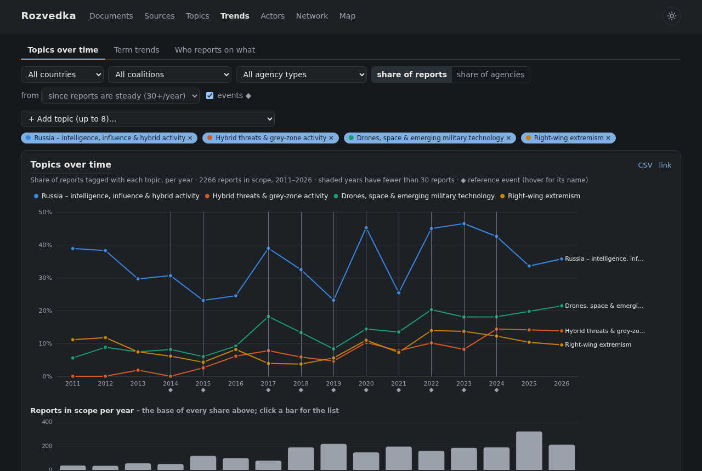
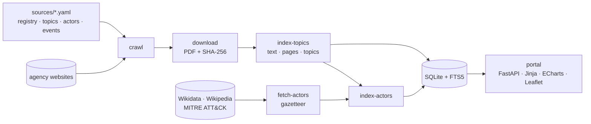

<div align="center">

# Rozvedka

**A self-hosted library of the public reports of intelligence, security and civil-protection agencies –
collected, searchable, indexed by topic and actor, and traceable back to the page they came from.**


[Features](#features) · [Quick start](#quick-start) · [Commands](#commands) · [Configuration](#configuration) ·
[How it works](#how-it-works) · [Development](#development) · [Sources & licences](#data-sources-and-licences)



</div>

## About

Intelligence services, cyber-security centres, civil-protection authorities and police agencies publish annual
reports, threat assessments and risk analyses. Rozvedka gathers them from the agencies' own websites into one
local library, so you can follow how state security, social resilience and disaster preparedness are developing
– and who reports on what.

| | |
|---|---|
| **Coverage** | 120 agencies and institutions in 46 countries and bodies: 26 EU member states, EU bodies and NATO, the UK, Norway, Switzerland, Ukraine, the USA, Canada, six Latin American countries, Australia, New Zealand, Japan, South Korea and Taiwan |
| **Library** | about 3,100 reports in 25 languages, with archives back to 2000, downloaded as PDF |
| **Index** | full text of every report, 64 topics from a 3,800-term multilingual keyword list, about 1,550 named actors and 189 countries |
| **Runs on** | a Raspberry Pi (or any Linux box) – Python, SQLite and the browser; no cloud service, no account |

> [!IMPORTANT]
> **Everything is traceable.** Every number on every chart opens the list of documents it counts; every actor
> mention links to the page of the PDF it was found on; every external fact (an event date, a Wikidata
> designation, a Wikipedia summary) carries its source, revision and retrieval date. Nothing is estimated or
> generated – counts are counts of documents.

## Features

### 📚 Documents

The library itself: every report with its agency, country, language, year and topics.

- Filter by country, coalition (EU, NATO, Five Eyes, G7, Schengen, AUKUS, JEF, NATO IP4), agency type, language,
  year or year range, download status, topic (several at once) and actor.
- **Full-text search inside the reports** – `"quoted phrases"`, `OR` for translations
  (`drone OR Drohne OR dron`), results with highlighted snippets, sorted by relevance or year.
- Open a downloaded PDF, or the agency's original; correct a title, language or year; hide irrelevant files; add a
  document by URL for sites that block automatic downloads.

### 🏛️ Sources

One card per agency: flag, logo, official name in the original language and in English, home page, a short
description of what its reports cover, coalition tags with the year each country joined, the report pages it is
crawled from (with language and current/archive), and a link to its headquarters on the map.

### 🏷️ Topics and full-text index


- 64 topics in 9 categories – extremism, state threats, geopolitics, cyber, crime, migration, hazards,
  resilience, governance – e.g. *right-wing extremism*, *Russia – intelligence, influence & hybrid activity*,
  *drones & emerging military technology*, *floods & extreme weather*, *civil defence*.
- Each topic is defined by keywords in 28 languages in [`sources/topics.yaml`](sources/topics.yaml); a report gets
  a topic only when it mentions it substantially, not in passing.

### 📈 Trends

<table>
<tr>
<td width="50%"></td>
<td width="50%"></td>
</tr>
<tr>
<td><b>Term trends</b> – any words over time, one line per term, with translations joined by <code>OR</code>.</td>
<td><b>Who reports on what</b> – countries or agencies × topics for a period.</td>
</tr>
</table>

- **Topics over time** – share of reports (or of reporting agencies) per year for up to 8 topics, with the number
  of reports per year beneath, plus the topics that rose and fell most in the last two years.
- **Reference events** (9/11, the annexation of Crimea, COVID-19, the invasion of Ukraine, …) marked on the time
  axis, dated from Wikidata.
- Every view has a permalink, a table view, a CSV export with a source link on every row and a *Where these
  numbers come from* section (method, filters, excluded documents, taxonomy version).

### 🕵️ Actors


- An index of state services, cyber threat groups, terrorist-designated and armed groups, organised crime,
  movements and key people, built from **Wikidata**, **Wikipedia** and **MITRE ATT&CK**, and found by name in the
  report texts – in all report languages and with the aliases of each group (APT28 = Fancy Bear = Sofacy =
  Forest Blizzard).
- Each actor page: reference data with its source and revision, the Wikipedia lead, mentions per year, which
  agencies report on it, the topics of those reports, actors named in the same passage, and **the passages
  themselves with a link to the cited page of the PDF**.
- Name matching is rule-based and transparent: every name used (or not used, with the reason) is listed, and
  `/actors/names` shows the most frequent matches for review.

### 🕸️ Network


Which actors the reports name **together more often than their frequency predicts** – not just most often:

- **Clusters** of strongly associated actors (e.g. *Wagner Group · Prigozhin · Internet Research Agency*,
  *Fancy Bear · Cozy Bear · Turla · Ghostwriter*, *LockBit · Conti · Akira*), each as a card with its members,
  strongest ties, the main topics of its reports, a timeline and the agencies that report on it.
- **Association matrix** of all actors, ordered by cluster: each cell is a pair named in the same passage, shaded
  by association strength (normalised pointwise mutual information); clusters appear as blocks.
- **Details panel**: an actor's most strongly associated and most frequent partners, or a pair's counts against
  what chance would predict.
- Filter by period, reporting coalition, agency type, topic and kind of actor. Every number opens the passages or
  reports it counts.

### 🗺️ Map

<table>
<tr>
<td width="50%"></td>
<td width="50%"></td>
</tr>
<tr>
<td><b>Headquarters</b> – every agency on a dark world map, coloured by type, with a hover card.</td>
<td><b>Who reports on whom</b> – the share of each country's reports that name a country, or what one country or coalition reports on.</td>
</tr>
</table>

Countries are recognised by their names and demonyms in the report languages (from Wikidata); a country's own
reports are left out, and selections with fewer than 10 reports are greyed out.

### 🧠 Topic mind map


Categories → topics → the actors most characteristic of each topic (counted in the reports that have the topic
among their three main topics), with a details panel and links to every count.

### 🌗 Dark and light theme

Dark by default; the sun/moon button in the header switches to light and back. The choice is remembered in the
browser, and charts redraw in the matching colours. The maps stay dark in both themes.

### 🔄 Automatic updates

A weekly job crawls every report page, downloads new reports, improves poor titles from the PDF metadata, and
indexes the new texts for search, topics and actors. Crawling is polite: robots.txt is respected and each host
gets at most one request every 2 seconds.

## Quick start

```bash
git clone https://github.com/iiogurt/Rozvedka.git ~/Documents/Projects/Rozvedka
cd ~/Documents/Projects/Rozvedka
python3 -m venv .venv && .venv/bin/pip install -r requirements.txt
sudo apt install poppler-utils chromium      # pdftotext (text extraction), Chromium (JavaScript-only sites)

.venv/bin/python -m rozvedka update          # crawl, download, extract and index (first run: hours)
.venv/bin/python -m rozvedka fetch-actors    # reference data for the actor index (a few minutes)
.venv/bin/python -m rozvedka index-actors
.venv/bin/python -m rozvedka serve           # → http://<host>:8080
```

> [!WARNING]
> The portal has no login. It listens on your LAN; do not expose it to the internet.

> [!NOTE]
> `data/` is not in git. It holds the database (`rozvedka.db`), the downloaded PDFs (`files/`, 12+ GB), logos and
> the actor gazetteer. Back it up separately.

### Run as a service

systemd user units, no root needed (except once for `enable-linger`, which keeps them running without a login):

```bash
systemctl --user link "$PWD/deploy/rozvedka-web.service" "$PWD/deploy/rozvedka-update.service" "$PWD/deploy/rozvedka-update.timer"
systemctl --user daemon-reload
systemctl --user enable --now rozvedka-web.service rozvedka-update.timer   # portal + weekly update (Sun 03:00)
sudo loginctl enable-linger "$USER"
```

## Commands

`python -m rozvedka <command>` (from the project directory, with `.venv/bin/python`):

| Command | What it does |
|---|---|
| `update [--country CZ]` | everything the weekly timer runs: crawl → download → improve titles → index topics → index actors |
| `sync-registry` | load `sources/registry.yaml` into the database |
| `crawl [--country CZ] [--agency BIS]` | find new documents on the report pages (no download) |
| `download [--country CZ] [--limit N] [--retry-failed]` | download discovered documents |
| `index-topics [--reextract]` | extract text for full-text search and tag topics; re-classifies after `topics.yaml` changes |
| `fetch-actors` | download the actor gazetteer from Wikidata, Wikipedia and MITRE ATT&CK (network) |
| `index-actors [--rematch]` | find the actors in the report texts (offline) |
| `fetch-logos [--refresh]` | download agency logos from their home pages |
| `improve-titles` | replace poor document titles with the title stored in the PDF |
| `serve [--host] [--port]` | run the portal (default `0.0.0.0:8080`) |
| `stats` | documents found and downloaded per country |
| `--version` | release version and git build |

Tools in `tools/`: `check_registry.py` (does every registry URL still load), `build_sources_md.py` (regenerate
[`sources/sources.md`](sources/sources.md)), `geocode_hq.py`, `find_variants.py`, `build_events.py` (resolve event
markers against Wikidata), `bump_version.py` (cut a release).

## Configuration

Everything that defines *what* Rozvedka collects and recognises is a hand-editable YAML file in `sources/`:

| File | Contents |
|---|---|
| [`registry.yaml`](sources/registry.yaml) | the agencies: names, type, home page, description, headquarters, report pages (language, current/archive), how to fetch them |
| [`countries.yaml`](sources/countries.yaml) | country names, regions, coalition memberships with year joined |
| [`topics.yaml`](sources/topics.yaml) | topic taxonomy: categories → topics → keywords per language |
| [`actors.yaml`](sources/actors.yaml) | which Wikidata classes, hand-listed seeds and countries make up the actor index, and matching corrections |
| [`events.yaml`](sources/events.yaml) | reference events for the trend charts (Wikipedia titles; dates are resolved from Wikidata) |

<details>
<summary><b>How sources are fetched</b> (<code>access</code> in the registry)</summary>

| `access` | Behaviour |
|---|---|
| `auto` | plain HTTP fetch |
| `browser-ua` | same, with a curl fallback for servers that reject Python's TLS handshake |
| `tls-lenient` | skip certificate verification (server sends an incomplete chain) |
| `browser-js` | the page is rendered with headless Chromium |
| `manual` | bot-protected; add documents in the portal (Sources → *Add a document by URL*) |

Pages that turn out to be empty JavaScript shells are rendered with Chromium automatically. Report pages marked
`verified: false` are listed but not crawled.

</details>

<details>
<summary><b>How topics are assigned</b></summary>

- Keyword syntax: `word` (whole word), `stem*` (words starting with the stem), `two words` (a phrase; each token may
  end in `*`), Japanese/Chinese/Korean terms as substrings. Case and accents are ignored; every language's terms
  apply to every document.
- A topic is assigned when the title matches, or when at least 2 different keywords occur and the hits keep up with
  the length (≥ 3, and at least one per 15,000 words).
- Text is extracted from the first 150 pages (up to 400,000 characters). After editing `topics.yaml`, run
  `index-topics` again – documents are re-classified from the stored text.

</details>

<details>
<summary><b>How actors are recognised</b></summary>

- **Who is listed:** Wikidata items of the classes in `actors.yaml` (with an English Wikipedia article, not
  dissolved before 2000, no states or companies), items "designated as terrorist by" (P3461), MITRE ATT&CK
  groups (joined to Wikidata through P9025 or a unique shared name), and hand-listed seeds.
- **How mentions are found:** by name – Wikidata labels and aliases in the report languages, ATT&CK aliases,
  hand-added names; case-sensitive, accent-insensitive, headings in capitals included.
- **Rules against false matches** (each shown with its reason on the actor page): ignore lists and per-actor
  exclusions; lowercase, very short and generic one-word names; names shared by several actors; one-word names of
  people other than the surname; generic names and short abbreviations ("FSB", "National Security Council") count
  only together with another name of the actor; the longest of overlapping names wins; reports dated before an
  actor was founded and reports of sources excluded for an actor are not counted.
- **Countries** are actors too (kind *country*): sovereign states from Wikidata with their labels, aliases and
  demonyms ("Russian", "russe"), so the portal can count which countries' reports name which countries. Two-letter
  forms ("UK", "US") count only together with another name.
- **Named together:** two actors named within 600 characters in a report are stored as a pair; the network, the
  actor pages and the passage pages (`/actors/<a>/with/<b>`) all count these pairs per report.
- **Correcting it:** `/actors/names` lists the names with the most matches. Add a wrong one under
  `ignore_aliases`, `exclude_aliases`, `weak_aliases` or `exclude_sources` in `actors.yaml` and run
  `index-actors` again.

</details>

<details>
<summary><b>Map data</b></summary>

Headquarters are the publicly listed headquarters or contact addresses (`hq: {address, lat, lon, precision}` in the
registry), geocoded once with OpenStreetMap Nominatim; the portal makes no geocoding calls. Solid pins are exact
buildings, hollow pins street or city level. `/map#s-<id>` zooms to one agency, `/map?tiles=0` works offline.

</details>

## How it works



| Module | Role |
|---|---|
| `rozvedka/registry.py`, `crawler.py`, `fetch.py` | load the registry, find document links (robots.txt, per-host delay, curl and Chromium fallbacks) |
| `rozvedka/downloader.py` | download, check the PDF header, de-duplicate by SHA-256, improve titles |
| `rozvedka/topics.py` | text extraction with page offsets, FTS5 index, topic classification (all CPU cores) |
| `rozvedka/actor_sources.py`, `actors.py` | build the gazetteer from public reference data; match actors in the texts |
| `rozvedka/trends.py` | the statistics behind the Trends pages, each with the link that reproduces it |
| `rozvedka/graphs.py` | network associations and clusters, who-reports-on-whom and topic mind map data, with the same links |
| `rozvedka/app.py`, `templates/`, `static/` | the server-rendered portal |

## Development

```bash
.venv/bin/pip install -r requirements-dev.txt
.venv/bin/python -m pytest -q
```

- **Workflow:** `main` always holds working code. Work on a branch (`feat/…`, `fix/…`, `sources/…`, `docs/…`) and
  merge through a pull request. Registry edits go in their own commits (`sources: add Latvian SAB reports page`).
- **Never commit** `data/`, `.env` or credentials – `.gitignore` covers them.
- **Versioning:** [Semantic Versioning](https://semver.org) by significance – *patch* for fixes, sources, keywords
  and visual changes; *minor* for new capabilities; *major* for incompatible changes (table in
  [`CHANGELOG.md`](CHANGELOG.md#versioning)). The portal footer, `/api/version` and `--version` show the git build
  between releases (`0.11.0+3.g1a2b3c4`).
- **Releasing:**
  ```bash
  python3 tools/bump_version.py minor      # patch | minor | major; --dry-run to preview
  # commit, open and merge the pull request, then tag the merge commit:
  git switch main && git pull
  git tag -a v<version> -m "Rozvedka <version>" && git push origin v<version>
  ```
  `bump_version.py` updates `rozvedka/__init__.py`, the changelog and the version badge above. GitHub releases
  carry the changelog section as notes; the portal shows the changelog at `/changelog`.

## Data sources and licences

| Component | Source | Licence / terms |
|---|---|---|
| Reports | the agencies' official websites, listed in [`sources/sources.md`](sources/sources.md) | the publishers' terms; downloaded for personal reference, not redistributed |
| Agency logos | the agencies' home pages (`data/logos/`, not committed) | the agencies' marks |
| Flags | [flag-icons](https://github.com/lipis/flag-icons) | MIT ([`LICENSE.flag-icons`](rozvedka/static/flags/LICENSE.flag-icons)); `nato.svg`, `other.svg` drawn for this project |
| Actor reference data | [Wikidata](https://www.wikidata.org) | CC0 |
| Actor summaries | [English Wikipedia](https://en.wikipedia.org) | CC BY-SA 4.0, attributed with article and revision on each page (also in the actor screenshot above) |
| Threat groups | [MITRE ATT&CK®](https://attack.mitre.org) | © The MITRE Corporation, reproduced with permission |
| Event dates | Wikidata via `tools/build_events.py` | CC0 |
| Charts | [Apache ECharts](https://echarts.apache.org) 6.1.0, vendored | Apache-2.0 |
| Map | [Leaflet](https://leafletjs.com) 1.9.4, Leaflet.markercluster 1.5.3, [Natural Earth](https://www.naturalearthdata.com) outlines | BSD-2, MIT, public domain |
| Street tiles | [OpenStreetMap](https://www.openstreetmap.org/copyright), loaded in the viewer's browser | ODbL, © OpenStreetMap contributors; OSM tile usage policy |

> [!CAUTION]
> **Reading the results.** Topics and actors are recognised by keywords and names, not by understanding: they show
> what reports *talk about*, not what they conclude. More mentions mean more attention, not necessarily a larger
> threat, and agencies publish different kinds of reports at different rhythms. Scanned PDFs without a text layer
> cannot be indexed. Check any surprising number by following its link to the documents and passages.
